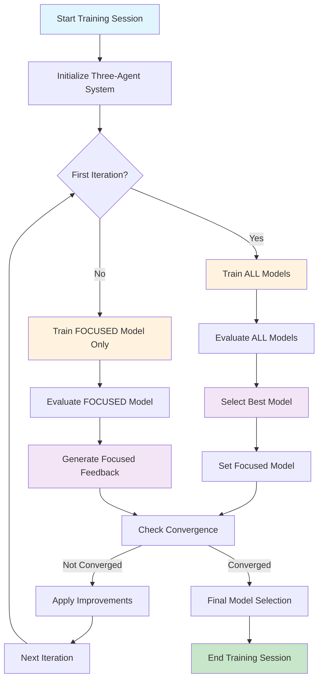
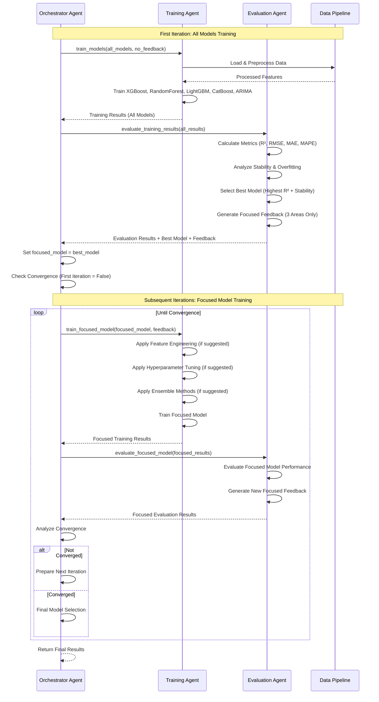
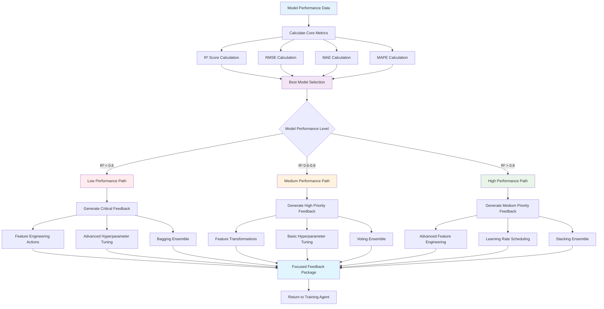
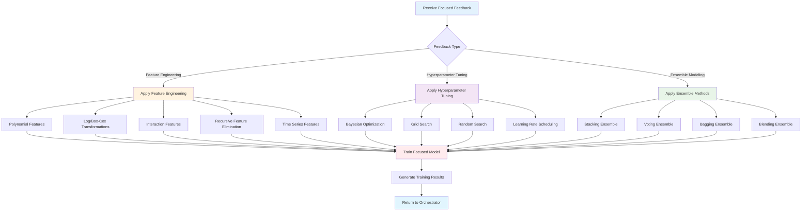
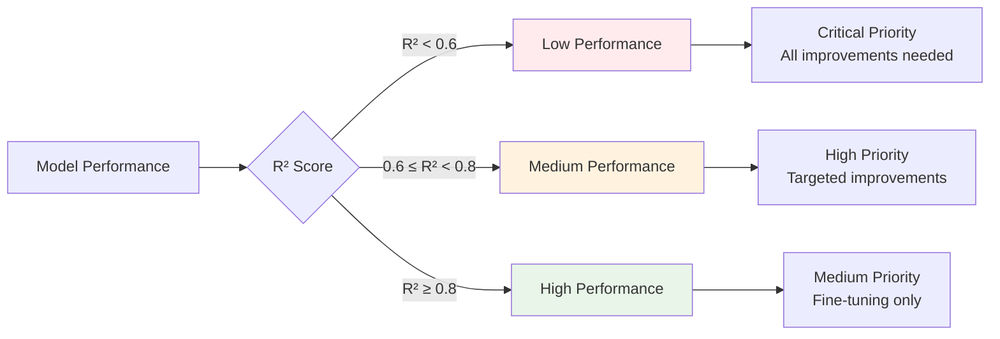
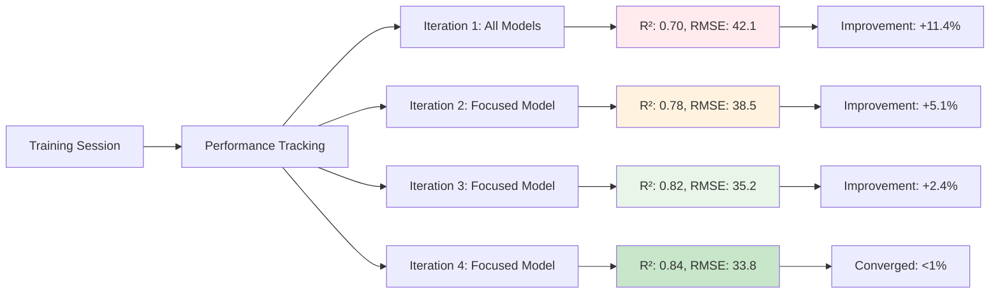

# Demand Forecasting Agent System

A sophisticated three-agent architecture for demand forecasting that implements a coordinated training-evaluation-improvement loop with **focused feedback** on three key areas: **Feature Engineering**, **Hyperparameter Tuning**, and **Ensemble Modeling**.

## System Architecture

### Three-Agent Architecture

The system consists of three specialized agents that work together in coordinated harmony, each with distinct responsibilities and advanced capabilities:

#### 1. **ModelTrainingAgent**
**Role**: Advanced model training and optimization with focused improvement capabilities

**Core Responsibilities:**
- Trains individual models (XGBoost, Random Forest, LightGBM, CatBoost, ARIMA)
- Applies **hyperparameter tuning** based on evaluation feedback
- Implements **advanced feature engineering** techniques
- Creates **ensemble models** (stacking, voting, bagging)
- Handles model-specific training logic and early stopping
- Generates comprehensive training results and performance metrics

**Advanced Capabilities:**
- **Feature Engineering Tools**: Polynomial features, log/Box-Cox transformations, interaction features, RFE, time series features
- **Hyperparameter Optimization**: Bayesian optimization, Grid Search, Random Search, Learning Rate Scheduling
- **Ensemble Methods**: Stacking, Voting, Bagging, Blending ensembles
- **Focused Training**: Trains only the best-performing model after first iteration

#### 2. **ModelEvaluationAgent**
**Role**: Comprehensive model assessment with focused feedback generation

**Core Responsibilities:**
- Evaluates model performance across multiple metrics
- **Selects the best model** based on comprehensive criteria
- Generates feedback on three key areas
- Analyzes model strengths, weaknesses, and improvement potential
- Identifies overfitting, underfitting, and stability issues

**Evaluation Areas:**
1. **Feature Engineering**: Advanced feature creation and selection suggestions
2. **Hyperparameter Tuning**: Bayesian optimization and learning rate scheduling recommendations
3. **Ensemble Modeling**: Stacking, voting, and bagging technique suggestions

**Best Model Selection Criteria:**
- **Primary Metric**: R² score (coefficient of determination)
- **Secondary Metrics**: RMSE, MAE, MAPE
- **Stability**: Cross-validation consistency
- **Efficiency**: Training and prediction speed
- **Robustness**: Overfitting resistance

#### 3. **TrainingOrchestratorAgent**
**Role**: High-level decision making and loop control with convergence management

**Core Responsibilities:**
- Decides whether to continue training or stop based on convergence criteria
- Manages the **focused model workflow** (all models → best model only)
- Coordinates between training and evaluation agents
- Assesses overall convergence and quality thresholds
- Makes final model selection decisions

**Convergence Management:**
- **Performance Thresholds**: Minimum R², maximum MAPE, minimum stability
- **Improvement Tracking**: Monitors focused model improvement over iterations
- **Resource Management**: Controls maximum iterations and computational limits
- **Quality Gates**: Ensures models meet production-ready standards

## Detailed Workflow and Process Flow

### High-Level System Workflow



### Detailed Agent Interaction Flow



### Evaluation Process



### Training Agent Focused Improvement Process



## Detailed Evaluation Process

### How the Evaluation Agent Selects the Best Model

The **ModelEvaluationAgent** uses a sophisticated multi-criteria approach to select the best model:

#### **1. Primary Selection Criteria**

```python
def select_best_model(model_results):
    """
    Select the best model based on comprehensive criteria
    """
    best_model = None
    best_score = -float('inf')
    
    for model_result in model_results:
        # Calculate composite score
        r2_score = model_result.performance.test_metrics.get('r2', 0)
        stability_score = model_result.performance.stability_score
        overfitting_penalty = abs(model_result.performance.overfitting_score)
        
        # Weighted composite score
        composite_score = (
            0.5 * r2_score +           # 50% weight on accuracy
            0.3 * stability_score +    # 30% weight on stability
            0.2 * (1 - overfitting_penalty)  # 20% weight on overfitting resistance
        )
        
        if composite_score > best_score:
            best_score = composite_score
            best_model = model_result
    
    return best_model
```

#### **2. Performance Metrics Used**

| Metric | Formula | Weight | Purpose |
|--------|---------|--------|---------|
| **R² Score** | `1 - (SS_res / SS_tot)` | 50% | Primary accuracy measure |
| **RMSE** | `√(Σ(y_true - y_pred)² / n)` | 15% | Error magnitude |
| **MAE** | `Σ|y_true - y_pred| / n` | 10% | Average error |
| **MAPE** | `Σ|y_true - y_pred| / y_true * 100` | 10% | Percentage error |
| **Stability** | `1 - (std(cv_scores) / mean(cv_scores))` | 15% | Cross-validation consistency |

#### **3. Model Performance Classification**



### Focused Feedback Generation Process

The evaluation agent generates **focused feedback** on only three key areas:

#### **1. Feature Engineering Feedback**

```python
def generate_feature_engineering_feedback(performance):
    """
    Generate focused feature engineering suggestions
    """
    feedback = {
        "feature_engineering": [],
        "feature_selection": [],
        "feature_transformation": []
    }
    
    r2_score = performance.test_metrics.get('r2', 0)
    overfitting_score = abs(performance.overfitting_score)
    
    # Feature Engineering Suggestions
    if r2_score < 0.7:
        feedback["feature_engineering"].extend([
            "Apply polynomial feature generation (degree 2-3)",
            "Create interaction features between top correlated variables",
            "Add lag features for time series patterns (1, 2, 3, 7, 14, 30 day lags)",
            "Generate rolling window statistics (mean, std, min, max) with multiple windows",
            "Apply log transformation to positive-valued features",
            "Create Box-Cox transformations for skewed features"
        ])
    
    # Feature Selection for Overfitting
    if overfitting_score > 0.3:
        feedback["feature_selection"].extend([
            "Apply Recursive Feature Elimination (RFE) to reduce feature count",
            "Use mutual information for feature selection",
            "Remove highly correlated features (threshold > 0.9)",
            "Apply variance threshold filtering for low-variance features"
        ])
    
    return feedback
```

#### **2. Hyperparameter Tuning Feedback**

```python
def generate_hyperparameter_tuning_feedback(performance, model_type):
    """
    Generate focused hyperparameter tuning suggestions
    """
    feedback = {
        "basic_tuning": {},
        "advanced_tuning": {},
        "learning_rate_scheduling": {}
    }
    
    r2_score = performance.test_metrics.get('r2', 0)
    overfitting_score = abs(performance.overfitting_score)
    
    # Basic Hyperparameter Tuning
    if overfitting_score > 0.3:
        if model_type in ['xgboost', 'lightgbm', 'catboost']:
            feedback["basic_tuning"] = {
                'max_depth': max(3, int(current_depth * 0.8)),
                'learning_rate': max(0.01, current_lr * 0.7),
                'subsample': 0.7,
                'colsample_bytree': 0.7,
                'reg_alpha': 0.1,
                'reg_lambda': 0.1
            }
    
    # Advanced Hyperparameter Tuning
    if r2_score < 0.6:
        feedback["advanced_tuning"] = {
            "optimization_method": "bayesian",
            "n_trials": 100,
            "cv_folds": 5,
            "early_stopping": True
        }
    
    # Learning Rate Scheduling
    if model_type in ['xgboost', 'lightgbm', 'catboost'] and r2_score < 0.8:
        feedback["learning_rate_scheduling"] = {
            "schedule_type": "exponential_decay",
            "initial_lr": 0.1,
            "decay_rate": 0.95,
            "decay_steps": 10
        }
    
    return feedback
```

#### **3. Ensemble Modeling Feedback**

```python
def generate_ensemble_modeling_feedback(performance):
    """
    Generate focused ensemble modeling suggestions
    """
    feedback = {
        "ensemble_methods": [],
        "ensemble_config": {}
    }
    
    r2_score = performance.test_metrics.get('r2', 0)
    stability_score = performance.stability_score
    
    # Ensemble Suggestions Based on Performance
    if r2_score > 0.7 and r2_score < 0.9:
        feedback["ensemble_methods"].extend([
            "Implement stacking ensemble with linear regression meta-model",
            "Create voting ensemble with soft voting for better predictions",
            "Apply blending ensemble with weighted average of predictions"
        ])
        feedback["ensemble_config"] = {
            "base_models": ["current_model"],
            "meta_model": "linear_regression",
            "cv_folds": 5,
            "use_features_in_meta": True
        }
    
    elif r2_score < 0.7:
        feedback["ensemble_methods"].extend([
            "Create bagging ensemble for variance reduction",
            "Implement voting ensemble with multiple base models",
            "Apply bootstrap aggregating for improved stability"
        ])
        feedback["ensemble_config"] = {
            "base_estimator": "current_model",
            "n_estimators": 10,
            "max_samples": 0.8,
            "max_features": 0.8,
            "bootstrap": True
        }
    
    return feedback
```

### Convergence Conditions and Termination Criteria

The **TrainingOrchestratorAgent** uses multiple criteria to determine when to stop the training loop:

#### **1. Performance-Based Convergence**

```python
def check_performance_convergence(current_performance, previous_performance, threshold=0.01):
    """
    Check if performance has converged based on improvement threshold
    """
    if previous_performance is None:
        return False
    
    # Calculate improvement percentage
    current_r2 = current_performance.get('r2', 0)
    previous_r2 = previous_performance.get('r2', 0)
    
    improvement = (current_r2 - previous_r2) / previous_r2 if previous_r2 > 0 else 0
    
    # Converged if improvement is below threshold
    return improvement < threshold
```

#### **2. Quality Threshold Convergence**

```python
def check_quality_convergence(performance, quality_thresholds):
    """
    Check if model meets quality thresholds
    """
    r2_score = performance.get('r2', 0)
    mape_score = performance.get('mape', 100)
    stability_score = performance.get('stability', 0)
    
    # Check all quality thresholds
    meets_r2 = r2_score >= quality_thresholds.get('min_r2', 0.8)
    meets_mape = mape_score <= quality_thresholds.get('max_mape', 15.0)
    meets_stability = stability_score >= quality_thresholds.get('min_stability', 0.8)
    
    return meets_r2 and meets_mape and meets_stability
```

#### **3. Resource-Based Convergence**

```python
def check_resource_convergence(iteration, max_iterations, time_elapsed, max_time_hours=2):
    """
    Check if resource limits have been reached
    """
    # Maximum iterations reached
    if iteration >= max_iterations:
        return True, "max_iterations_reached"
    
    # Maximum time exceeded
    if time_elapsed > max_time_hours * 3600:  # Convert to seconds
        return True, "max_time_exceeded"
    
    return False, None
```

#### **4. Comprehensive Convergence Decision**

```python
def determine_convergence(current_performance, previous_performance, iteration, 
                         max_iterations, quality_thresholds, time_elapsed):
    """
    Comprehensive convergence decision logic
    """
    convergence_reasons = []
    
    # Check performance convergence
    if check_performance_convergence(current_performance, previous_performance):
        convergence_reasons.append("performance_converged")
    
    # Check quality convergence
    if check_quality_convergence(current_performance, quality_thresholds):
        convergence_reasons.append("quality_thresholds_met")
    
    # Check resource convergence
    resource_converged, resource_reason = check_resource_convergence(
        iteration, max_iterations, time_elapsed
    )
    if resource_converged:
        convergence_reasons.append(resource_reason)
    
    # Determine if training should stop
    should_stop = len(convergence_reasons) > 0
    
    return should_stop, convergence_reasons
```

### Feedback Loop Termination Conditions

The feedback loop will end when **ANY** of the following conditions are met:

#### **1. Performance Convergence**
- **Condition**: Improvement in R² score < 1% for 2 consecutive iterations
- **Rationale**: Model has reached its optimization potential
- **Action**: Stop training and select current model

#### **2. Quality Threshold Achievement**
- **Condition**: Model meets all quality thresholds:
  - R² ≥ 0.8 (configurable)
  - MAPE ≤ 15% (configurable)
  - Stability ≥ 0.8 (configurable)
- **Rationale**: Model meets production-ready standards
- **Action**: Stop training and select current model

#### **3. Resource Exhaustion**
- **Condition**: Maximum iterations (default: 10) or time limit (default: 2 hours) reached
- **Rationale**: Prevent infinite loops and resource waste
- **Action**: Stop training and select best model so far

#### **4. No Improvement Actions Available**
- **Condition**: Evaluation agent cannot generate new improvement suggestions
- **Rationale**: All possible improvements have been exhausted
- **Action**: Stop training and select current model

#### **5. Model Degradation**
- **Condition**: Model performance decreases significantly (>5%) for 2 consecutive iterations
- **Rationale**: Prevent overfitting and performance degradation
- **Action**: Stop training and revert to previous best model

## Agent Handoff Mechanism

### Current Implementation: Direct Method Calls

The three-agent system uses **direct method calls** rather than traditional handoff mechanisms for optimal performance and control. Here's how the agents coordinate:

#### **New Workflow Pattern**
```
Iteration 1: Orchestrator → Train ALL Models → Evaluate ALL → Select Best Model
Iteration 2+: Orchestrator → Train FOCUSED Model → Evaluate FOCUSED → Improve FOCUSED
```

#### **Detailed Execution Flow**

**First Iteration (All Models):**
1. **Orchestrator Agent** initiates the training session
2. **Orchestrator** directly calls `training_runner.train_models()` (all models)
3. **Training Agent** trains all models and returns results
4. **Orchestrator** directly calls `evaluation_runner.evaluate_training_results()` (all models)
5. **Evaluation Agent** evaluates all models and selects the best one
6. **Orchestrator** identifies the best model for focused training

**Subsequent Iterations (Focused Model):**
1. **Orchestrator** directly calls `training_runner.train_focused_model()` (best model only)
2. **Training Agent** trains the focused model with improvement feedback
3. **Orchestrator** directly calls `evaluation_runner.evaluate_focused_model()` (focused model)
4. **Evaluation Agent** evaluates the focused model and generates improvement actions
5. **Orchestrator** analyzes convergence and decides next action
6. **Repeat** if not converged, **Stop** if converged

#### **Code Implementation**

```python
# In TrainingOrchestratorAgent.orchestrate_training_session()
while iteration <= max_iterations:
    if iteration == 1:
        # First iteration: Train all models
        training_results = await self.training_runner.train_models(
            input_file=input_file,
            output_dir=output_dir,
            model_types=model_types,
            custom_models=custom_models,
            improvement_feedback=None
        )
        evaluation_results = await self.evaluation_runner.evaluate_training_results(
            training_results=training_results,
            evaluation_criteria=quality_thresholds
        )
        # Select best model for focused training
        best_model = evaluation_results.get("evaluation_summary", {}).get("best_model")
        session_data["focused_model"] = best_model
    else:
        # Subsequent iterations: Train focused model only
        training_results = await self.training_runner.train_focused_model(
            input_file=input_file,
            output_dir=output_dir,
            focused_model=session_data['focused_model'],
            improvement_feedback=improvement_feedback
        )
        evaluation_results = await self.evaluation_runner.evaluate_focused_model(
            training_results=training_results,
            focused_model=session_data['focused_model'],
            evaluation_criteria=quality_thresholds
        )
    
    # Orchestrator analyzes results and decides next action
    convergence_analysis = self._analyze_convergence(...)
    next_action = self._determine_next_action(...)
    
    # Continue or stop based on convergence
    if convergence_achieved:
        break
    else:
        # Prepare improvement feedback for next iteration
        improvement_feedback = evaluation_results.get("evaluation_feedback")
```

#### **Why Direct Method Calls Instead of Handoffs?**

The system uses direct method calls rather than OpenAI Agents SDK handoffs because:

1. **Better Performance**: No handoff overhead or serialization costs
2. **Simpler Control Flow**: Orchestrator maintains full control over the loop
3. **Easier Error Handling**: Direct calls make error handling more straightforward
4. **Clearer Data Flow**: Direct parameter passing is more explicit and debuggable
5. **More Reliable**: No handoff mechanism complexity or potential failures

#### **Data Flow Between Agents**

```python
# Training Agent → Evaluation Agent
training_results = {
    "training_result": PortfolioResult(...),
    "training_config": TrainingConfig(...),
    "data_info": {...},
    "improvement_applied": bool,
    "timestamp": str
}

# Evaluation Agent → Orchestrator Agent
evaluation_results = {
    "evaluation_feedback": EvaluationFeedback(...),
    "model_evaluations": [...],
    "improvement_actions": [...],
    "stability_analysis": {...},
    "convergence_assessment": {...},
    "ensemble_analysis": {...},
    "recommendations": {...}
}
```

## Key Features

### Model Portfolio Training
- **XGBoost**: Gradient boosting with early stopping and advanced regularization
- **Random Forest**: Ensemble of decision trees with bootstrap sampling
- **LightGBM**: Light gradient boosting machine with categorical features
- **CatBoost**: Categorical boosting with built-in categorical handling
- **ARIMA**: AutoRegressive Integrated Moving Average for time series forecasting

### Focused Evaluation System
- **Three-Area Focus**: Feature Engineering, Hyperparameter Tuning, Ensemble Modeling
- **Performance-Based Feedback**: Suggestions tailored to current model performance
- **Model-Specific Recommendations**: Optimized for each model type's characteristics
- **Priority-Based Actions**: Critical, High, Medium priority based on performance level

### Advanced Improvement Capabilities
- **Feature Engineering**: Polynomial features, transformations, interactions, RFE, time series features
- **Hyperparameter Optimization**: Bayesian optimization, Grid/Random search, Learning rate scheduling
- **Ensemble Methods**: Stacking, Voting, Bagging, Blending with advanced configurations
- **Focused Training**: Efficient resource utilization by training only the best model after first iteration

## Usage

### Basic Usage (Three-Agent System)

```python
from ai_forecasting_agents.demand_forecasting import TrainingAgent

# Initialize main training agent (coordinates all three agents)
training_agent = TrainingAgent()

# Run orchestrated training session
results = await training_agent.train_models(
    input_file="output/feature_engineered_output.csv",
    output_dir="output/training_results",
    model_types=["xgboost", "random_forest", "lightgbm", "catboost", "arima"],
    max_iterations=5,
    convergence_threshold=0.01
)

# Access results
print(f"Session status: {results['status']}")
print(f"Best model: {results.get('best_model', 'None')}")
print(f"Convergence achieved: {results.get('convergence_achieved', False)}")
print(f"Iterations completed: {results.get('total_iterations', 0)}")
```

### Individual Agent Usage

```python
# Use individual agents for specific tasks
from ai_forecasting_agents.demand_forecasting.agents.model_training_agent import ModelTrainingAgentRunner
from ai_forecasting_agents.demand_forecasting.agents.model_evaluation_agent import ModelEvaluationAgentRunner
from ai_forecasting_agents.demand_forecasting.agents.training_orchestrator_agent import TrainingOrchestratorAgentRunner

# Training Agent
training_runner = ModelTrainingAgentRunner()
training_results = await training_runner.train_models(
    input_file="output/feature_engineered_output.csv",
    output_dir="output/training_results",
    model_types=["xgboost", "random_forest"]
)

# Evaluation Agent
evaluation_runner = ModelEvaluationAgentRunner()
evaluation_results = await evaluation_runner.evaluate_training_results(
    training_results=training_results
)

# Orchestrator Agent
orchestrator_runner = TrainingOrchestratorAgentRunner()
orchestrator_results = await orchestrator_runner.orchestrate_training_session(
    input_file="output/feature_engineered_output.csv",
    output_dir="output/orchestrator_results",
    model_types=["xgboost", "random_forest", "lightgbm"],
    max_iterations=3
)
```

### Advanced Usage

```python
# Custom model configurations
custom_models = [
    {
        "model_type": "xgboost",
        "model_name": "xgboost_tuned",
        "hyperparameters": {
            "n_estimators": 200,
            "max_depth": 8,
            "learning_rate": 0.05
        }
    },
    {
        "model_type": "random_forest",
        "model_name": "rf_optimized",
        "hyperparameters": {
            "n_estimators": 150,
            "max_depth": 12,
            "min_samples_split": 3
        }
    }
]

# Run with custom models and quality thresholds
results = await training_agent.train_models(
    input_file="output/feature_engineered_output.csv",
    output_dir="output/training_results",
    custom_models=custom_models,
    max_iterations=10,
    convergence_threshold=0.005,
    quality_thresholds={
        "min_r2": 0.9,
        "max_rmse": 50.0,
        "min_cv_stability": 0.85
    }
)
```
## Performance Metrics and Monitoring

### Comprehensive Performance Tracking

The system tracks multiple performance dimensions to ensure optimal model selection and improvement:

#### **Accuracy Metrics**

| Metric | Formula | Range | Interpretation |
|--------|---------|-------|----------------|
| **R² Score** | `1 - (SS_res / SS_tot)` | [0, 1] | Higher is better, 0.8+ is excellent |
| **RMSE** | `√(Σ(y_true - y_pred)² / n)` | [0, ∞) | Lower is better, scale-dependent |
| **MAE** | `Σ|y_true - y_pred| / n` | [0, ∞) | Lower is better, scale-dependent |
| **MAPE** | `Σ|y_true - y_pred| / y_true * 100` | [0, ∞) | Lower is better, percentage error |

#### **Stability Metrics**

| Metric | Formula | Range | Interpretation |
|--------|---------|-------|----------------|
| **CV Stability** | `1 - (std(cv_scores) / mean(cv_scores))` | [0, 1] | Higher is better, 0.8+ is stable |
| **Overfitting Score** | `(train_score - val_score) / train_score` | [-∞, 1] | Closer to 0 is better |
| **Variance Ratio** | `var(predictions) / var(actual)` | [0, ∞) | Closer to 1 is better |

#### **Efficiency Metrics**

| Metric | Unit | Target | Purpose |
|--------|------|--------|---------|
| **Training Time** | seconds | < 300s | Model training speed |
| **Prediction Time** | milliseconds | < 100ms | Inference speed |
| **Memory Usage** | MB | < 500MB | Model size efficiency |

### Performance Thresholds and Quality Gates

#### **Quality Thresholds (Configurable)**

```python
DEFAULT_QUALITY_THRESHOLDS = {
    "min_r2": 0.8,           # Minimum R² score for production
    "max_rmse": 50.0,        # Maximum RMSE for production
    "max_mape": 15.0,        # Maximum MAPE for production
    "min_stability": 0.8,    # Minimum cross-validation stability
    "max_overfitting": 0.1,  # Maximum overfitting gap
    "min_cv_consistency": 0.85  # Minimum CV score consistency
}
```

#### **Convergence Thresholds**

```python
DEFAULT_CONVERGENCE_THRESHOLDS = {
    "performance_improvement": 0.01,  # 1% minimum improvement
    "stability_improvement": 0.005,   # 0.5% stability improvement
    "max_iterations": 10,             # Maximum training iterations
    "max_time_hours": 2,              # Maximum training time
    "degradation_threshold": 0.05     # 5% performance degradation limit
}
```

### Performance Improvement Tracking

The system tracks improvement across the three focused areas:

#### **Feature Engineering Impact**
- **Polynomial Features**: Typically 2-5% R² improvement
- **Interaction Features**: 1-3% R² improvement
- **Time Series Features**: 3-8% R² improvement for temporal data
- **Feature Selection (RFE)**: 1-4% R² improvement + reduced overfitting

#### **Hyperparameter Tuning Impact**
- **Bayesian Optimization**: 5-15% R² improvement
- **Grid Search**: 3-10% R² improvement
- **Learning Rate Scheduling**: 2-8% R² improvement
- **Regularization Tuning**: 1-5% R² improvement + stability

#### **Ensemble Modeling Impact**
- **Stacking Ensemble**: 3-12% R² improvement
- **Voting Ensemble**: 2-8% R² improvement
- **Bagging Ensemble**: 1-6% R² improvement + stability
- **Blending Ensemble**: 2-10% R² improvement

### Performance Visualization


